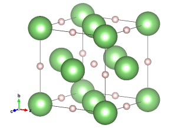

# Tutorial 1: Structure searching with AIRSS - LiH

## 1\. Structure Search with CASTEP

We will be investigating the ionic conductor LiH, using AIRSS with both DFT and the machine-learning potential framework EDDP (in the next tutorial). AIRSS is a package for the numerical discovery of favourable crystal structures across the energy landscape. It is closely integrated with [CASTEP](https://www.google.com/url?q=https://docs.google.com/document/u/1/d/e/2PACX-1vQxH_FaRty-LalfMFW3no5COI_NQTkdowKnIvErskJQ7czkv4B__e8cR6RPApstbGiXYd6yhF7PqH7K/pub&sa=D&source=editors&ust=1747677490654557&usg=AOvVaw2UnHPa8DgkjksjEqXZRXSB) (though it can also use other DFT codes and even interatomic potentials such as the EDDPs), and in essence, an AIRSS run is a series of local geometry optimisations. By initialising random sensible structures, AIRSS covers many different minima (or rather, the basins of attractions to these minima). The geometry optimisation relaxes the initially random structures to their local minima, one of which is the global minimum. We can never *guarantee* that this global minimum has actually been found, but if the lowest-energy structure reoccurs several times, we can be reasonably confident.

### Literature search

Before embarking on an AIRSS search, it is essential to determine the current state of knowledge on the system we are interested in. Search Google Scholar more generally, and then look for already existing crystal structures in the [Materials Project](https://www.google.com/url?q=https://next-gen.materialsproject.org/&sa=D&source=editors&ust=1747677490655665&usg=AOvVaw3A8wMptcMRucNZX8SLCyIl) and on [ICSD](https://www.google.com/url?q=https://www.psds.ac.uk/icsd&sa=D&source=editors&ust=1747677490655739&usg=AOvVaw2BypKtQyw_ffr7TNQb6wNh). In this case, you will quickly discover that the ground state of LiH at ambient conditions crystallises in the cubic rocksalt structure (space group Fm-3m, shown below). Since this is a demonstration, don't expect to find anything that contradicts this (but let us know if you do...). Knowledge of the Fm-3m-LiH structure will come in useful when designing our AIRSS search.



<p style="text-align: center;"> 
Fm-3m strcutre of LiH
</p>


### Designing our AIRSS search

Just like CASTEP (see the AIRSS Tutorials Preliminaries), AIRSS uses a `.cell` and a `.param` file. You are provided with `LiH.cell` and `LiH.param`. The `.param` file is unchanged from a regular CASTEP calculation and sets the parameters for the geometry optimisation. AIRSS carries out several short geometry optimisations instead of one long one. This is more efficient for our purposes, as it ensures aspects such as the k-point grid are more appropriate for structures across the minimisation path. Use `castep.serial -h` to understand the different geometry optimisation parameters in `LiH.param`.

The `.cell` file sets the parameters we are already used to from the CASTEP practical (see the AIRSS Tutorials Preliminaries), except instead of directly providing the `lattice` and `positions` blocks, we set a number of structure generation parameters. These are read by AIRSS and used to steer the random sensible construction of candidates. They are marked by a `#`, which conveniently also prevents CASTEP from reading them.\
Look at `LiH.cell`. The parameters you need to set are indicated, but the values are left for you to choose. AIRSS has two main types of parameters: those which have an equal sign require an input value, while those without an equal sign switch certain behaviour on or off.

-   One principle we can use to set some of these properties, in particular those relating to geometry, is that many favourable structures for a given system under a given set of conditions will be geometrically similar, having similar volumes per atom and interatomic distances. In this case, we can examine the Fm-3m structure we found earlier. If nothing at all were known about a system, you could do a brief AIRSS search to form an initial educated guess. You can use the Fm-3m structure as a starting point. The atomic visualisation software [VESTA](https://www.google.com/url?q=https://jp-minerals.org/vesta/en/&sa=D&source=editors&ust=1747677490658622&usg=AOvVaw2xiqUjcX3CB8l7DbjNh4ck)has a tool for measuring interatomic distances. Alternatively, the AIRSS tool `cryan`, called as `cryan -g < LiH-Fm-3m.res`, also returns geometrical data about the structure, including the volume per atom.[1]
-   `#SPECIES` sets the atomic species we are including in the search and certain of their properties. The syntax is `species_1%property_1 property_2 ..., species_2%...` `NUM=1` tells AIRSS to include 1 atom. This is fixed since we want to search LiH only. You can specify ranges of numbers (`MIN-MAX`), or a set from which one number is randomly chosen (`{a``1``,a``2``,...,a``n``}`), also. This is true of many AIRSS parameters. We can set other properties here as well, such as using `VOL` to set the volume per atom.
-   `#TARGVOL` sets the volume per atom. You probably want this to be a range. (`#VARVOL` does the same thing)
-   `#SYMMOPS` lets you set how many symmetry operations to apply to the crystal structure. Favourable crystal structures are often highly symmetric. For this reason, applying symmetry operations to your random structures can dramatically enhance your search efficiency. It is advisable to set this to a range, from which AIRSS randomly selects a number. No crystal can be fivefold symmetric, and the maximum number of symmetry operations a crystal can have is 48.
-   `#NFORM` lets you set how many *formula units* (sets of LiH) you want in your cell. Again, it is common to set this to a range. Take a moment to consider what might be sensible bounds for the range. Larger numbers of formula units will allow you to discover structures which cannot be described with fewer atoms, but will make your searches increasingly expensive. You probably don't want to use more than 5.
-   `#MINSEP` is the minimum interatomic distance between pairs of atoms. You can set this to the same value for all elements, or set it on an element-by-element basis. Here, we have opted for the latter. (Remember this parameter since it will be very important for EDDPs)
-   `#SLACK`, `#OVERLAP`, `#COMPACT`, `#CELLADAPT` are keywords governing the imposition of the aforementioned minimum separations. Don't worry too much about them.\
Note that this is only one - minimalist - way of setting up an AIRSS search. You are welcome to discuss others with the demonstrators. Options for searching in lower dimensions, searching defects, keeping parts of the search cell constant, among others, also exist.\
Once you have decided on a set of parameters, you should use the built-in AIRSS tool `buildcell` to check if your parameters produce sensible random structures, quickly. Feel free to also discuss your `LiH.cell` file with the demonstrators! Do this using `buildcell <`` LiH.cell`. If buildcell struggles or fails to generate random structures, you will need to adapt your parameters. Often, the cause of this is trying to pack too many atoms in too small a space, or a mismatch between `MINSEPs` and `VOLs`. You can save a structure generated by buildcell by redirecting the output: `buildcell < LiH > LiH-example.cell`. Study this structure in VESTA. Does it obey your constraints? How does it compare to the Fm-3m structure?

When you are confident you can generate sensible random structures, run your search with `spawn airss.pl -exec castep.mpi -seed LiH`. There are many other input flags you may want to use. Have a look at the output of `airss.pl -h`. Feel free to ask us about any settings which confuse you or about which you would like to know more! In particular, you may want to change `-mpinp`, which governs the parallelisation of the underlying CASTEP calculation. Make sure `-mpinp` is a factor of the number of cores you have available. The search should take no longer than ~15-20 minutes. While the search runs, read on in this practical and prepare for your next steps.\
AIRSS stores relaxed structures in the `.res` format and provides the `cryan` (`ca`) tool with which to analyse your datasets. `.res` files contain plenty of useful information. You should be able to easily spot the atomic positions. The cell is defined in the `CELL` line. The first number is irrelevant. The next three numbers are the lengths of the lattice vectors, and the final three numbers the angles (in degrees) between them. The most important line in a `.res` file is its `TITL` line, which accessibly stores a few crucial numbers characterising the structure. It has the format\
`TITL <name> <pressure> <volume> <enthalpy> <spin> <modulus of spin> <number of atoms> (<symmetry>) n - <number of copies>`.

`cryan` is the structural analysis tool for AIRSS. `ca` wraps it in order to enable application to many structures at once. Check all the options for `ca` by typing `ca -h` in the command line. `ca -r` ranks all found structures in order of their energies, from lowest to highest. Use this to check periodically if you have a recurring low(est)-energy structure. When the Fm-3m structure[2] is found several times, your search is completed and you can terminate it!\
There is a subtlety worth being aware of here - we have used rather sparse k-point sampling and a low energy cutoff, in order to accelerate the searches. This means the energy landscape is not quite correct, and as a result, your lowest-energy structure may not be the physical ground state (Fm-3m in this case). This necessitates a refinement step, to which we will return in the Tutorial 2.

Run `despawn` in the same directory you `spawn`ed the search. How much of your output set is formed by the Fm-3m structure? Does this surprise you? Make a note of how many structures you found in total, and how long this took you.\
While running your search, you can play with the built-in AIRSS option for setting up a search, which is called `gencell`. Type `gencell` in the command line to see its usage, and then try to use `gencell` to generate the inputs for an LiH structure search. Do this in a new directory to avoid overwriting your current search. Compare the `LiH.cell` file generated this way to the one we used for the search. Which different parameters do you notice?

## 2\. Structure Search with VASP


For the people who attend the summer school, it's possible to run AIRSS with a different DFT code such as VASP.\
The search is a repeat of that performed in 1., except this time the search will be performed using the VASP code. First create a `C2.POTCAR` file. The `airss.pl` script is used in the usual way, except the `-vasp` flag it set.

```console
$ spawn airss.pl -vasp -seed LiH
```

## 3\. Bonus : Carbon under pressure !


In this example we will explore the energy landscape of Carbon (cell of 2 atoms) at 100 GPa (or 1 MBar). For comparison, the pressure at the centre of the Earth is about 350 GPa.

Try to use gencell to generate an input for Carbon, type `gencell` if you need help. The C2.cell should have two C atoms (C1 and C2), thus a small `#VARVOL`. Think of an appropriate `#MINSEP` and why.

$ cat C2.cell

%BLOCK LATTICE_CART\
1.709975 0 0\
0 1.709975 0\
0 0 1.709975\
%ENDBLOCK LATTICE_CART\
**#**VARVOL=5\
%BLOCK POSITIONS_FRAC**C 0.0 0.0 0.0 #** C1 % NUM=1**C 0.0 0.0 0.0 #** C2 % NUM=1%ENDBLOCK POSITIONS_FRAC\
**#**MINSEP=1.3\
KPOINTS_MP_SPACING 0.07

The only AIRSS related command in the cell file is `#MINSEP=1.3`. This is not essential for the light elements, but for transition metals it is important to avoid core overlap to prevent poor convergence of the electronic structure. The k-points sampling density is 0.07, with 0.05 more appropriate for metallic (or nearly metallic) systems.

How can you specify the pressure (100 GPa) when running  `airss.pl`? Type `airss.pl -h` if need be.

**$** airss.pl -press 100 -max 10 -seed C2

**$** ca -r

C2-90568-5971-4      100.00     4.699  -151.660  2 C            Fd-3m      1\
C2-90568-5971-5      100.00     4.699     0.000  2 C            Fd-3m      1\
C2-90568-5971-7      100.01     4.698     0.002  2 C            Fd-3m      1\
C2-90568-5971-8       99.99     4.698     0.002  2 C            Fd-3m      1\
C2-90568-5971-2       99.99     4.697     0.003  2 C            Fd-3m      1\
C2-90568-5971-1       99.94     4.698     0.003  2 C            Fd-3m      1\
C2-90568-5971-6      100.00     4.695     0.005  2 C            Fd-3m      1\
C2-90568-5971-10     100.00     4.691     0.010  2 C            Fd-3m      1\
C2-90568-5971-3      100.05     5.379     0.871  2 C            C2/m       1\
C2-90568-5971-9      100.03     4.477     2.555  2 C            P1         1

In this very small cell, most of the structures found are the diamond structure (space group `Fd-3m`). If the search is repeated at lower pressures, for example 1 GPa, more graphitic structures will be found.

The example above is available on the AIRSS page <https://airss-docs.github.io/tutorials/examples/>, many other examples are provided if you want to deepen your skills on AIRSS.

4\. Further reading
===================

-   [This paper](https://www.google.com/url?q=https://journals.aps.org/prl/abstract/10.1103/PhysRevLett.97.045504&sa=D&source=editors&ust=1747677490684566&usg=AOvVaw26uXhkbEN6PO4YrBIzq3Ps) marks the first use of AIRSS and introduces the underlying reasoning.
-   [This paper](https://www.google.com/url?q=https://iopscience.iop.org/article/10.1088/0953-8984/23/5/053201/meta&sa=D&source=editors&ust=1747677490684800&usg=AOvVaw1eGvAGsSK_N14Oasun8adv) presents the AIRSS method more fully, summarising and justifying many of the observations and principles we encountered in this practical.

* * * * *

[1] To convert a `.cif` to a `.res` file, you can use `c2x` to convert from `.cif` to `.cell`, and then with `cabal` from `.cell`to `.res`. cabal works with the following format: `cabal input_format output_format < seed.input_format > seed.output_format`. Type `cabal -h `for more information.\
[2] Of course, the whole point is that normally you don't know which structure you are looking for.

This tutorial is a modified version of the tutorial made by Dr. Pascal Salzbrenner, the original version can be found on his github page: <https://github.com/PascalSalzbrenner/ljc_castep_airss_eddp_practicals?tab=readme-ov-file>.

