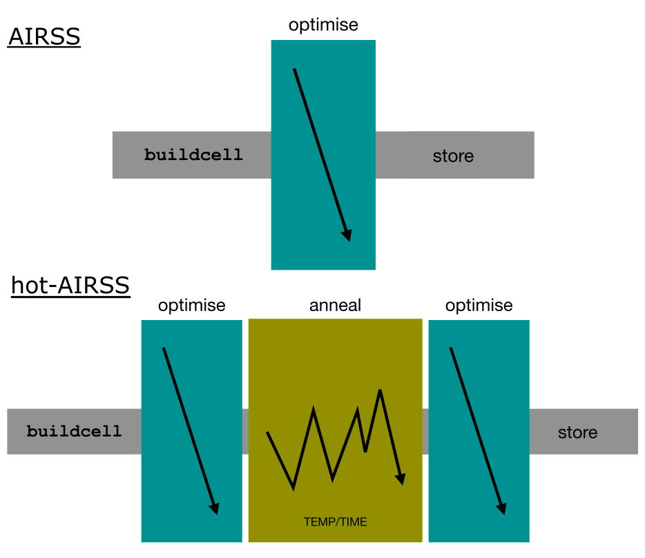

# Tutorial 3

In this tutorial we will look at carbon-nitrogen mixtures. These compounds have historically garnered interest as possible candidates super-hard materials. They form complex covalently bonded solids at high pressures, which are recoverable down to ambient conditions.

A recent study synthesised 3 carbon-nitrogen compounds, by laser heating under pressure, and solved their structures (https://doi.org/10.1002/adma.202308030)

We will explore stable CN structures and see if we can rediscover the hP126-C3N4 structure using two different approaches:

- A Symmetry constrained search with an EDDP.

- A Molecular Dynamics based search with an EDDP (hot-airss).

When searching for solids with complex bonding networks, we may need to use large system sizes. This can be particularly important when investigating system with large amounts of disorder.

To search larger systems, it may be tempting to simply increase the number of atoms in our cell file. However, as we increase the number of atoms in our system, the number of minima in the energy landscape rapidly increases (see Stillinger 1999 DOI: https://doi.org/10.1103/PhysRevE.59.48). The overwhelming majority of these minima resemble rapidly quenched liquids, with high disorder and high energy. When structure searching we are more interested in the ordered structures at low energy close to the convex hull. We can to introduce a couple of strategies to bias the search towards these structures.

One strategy is to enforce a certain number, or range, of symmetry operations. Other options include using a more sophisticated optimisation algorithm by introducing molecular dynamics. In this tutorial we will compare these two strategies.


## **1\. Evaluating the dataset and EDDP**

We will start by evaluating a pre-trained EDDP for the carbon-nitrogen system.

First, navigate to the to CN_eddp directory. You should see the input and output files of a potential training run.

```console

$ls

atomic.data  CN  CN.cell  CN.eddp  CN.param  data.res.xz  flock.out  help  logs  marks-save  plots
```

- How many structures were used to train this potential? (hint use the cryan summary)

- Assess the quality of the potential by looking at the training, validation and testing plots.

For this exercise we are interested in CN structures at 150 GPa that may be metastable down to ambient pressure. This means the dataset should contain structures spanning at least the pressure range 0-150 GPa.

Use the commands:

```
$ca -ph
$xmgrace C3N4-phull.agr &

```

to plot a 'pressure hull'. This shows the pressures of all structures in the dataset and their relative enthalpies. Is the dataset suitable for our application?

Store the potential to a unique directory, ready to be used, with the ddpstore command:

```console
$ ddpstore <seed>
```

## **2\. Running a high-symmetry search:**

Now navigate to the eddp_search directory. Copy the archived eddp to the new directory and extract it.

We want to run a search in of the C3N4 stoichiometry with 2-48 symmetry operations at a pressure of 150 GPa and a total number of 18 C3N4 formula units.

Try making the necessary changes to the cell file. Once you are satisfied, check your file against the help/CN.cell.

Submit the search on 20 cores with the following command:

XXX

Once your job has started running, check that structures are being generated but using ca -s.

Whilst we wait for the structure search to proceed, familiarise yourself with the structure in help/lanieletal/C3N4.res Make a note of the space group and the number of formula units.

Leave your search running, but in the interests of time we can skip forward to some ready-prepared search results.

Navigate to the airss_2-48symm directory.

Use cryan to look at the list of unique structures within a 100 meV/atom energy window from the hull.

Is the Laniel et al. structure there? Take some time to look through the various low energy structures in vesta.

Now generate a structural density of states to analyse the energy distribution of the various minima we have found

```console
$ca -sd 0.01
```
The 0.01 parameter is a gaussian smoothing, try a few parameters and decide on one that is most suitable.

Can you identify different families of structures in the structure DOS?

Now we will take a high energy structure from our search and run a short molecular dynamics trajectory.

first convert the res file to a cell file (note: some <> characters here indicate variables for you to change, others redirect input to files or cryan):

```console
$ ca -res -cell < <structure_id>.res > <structure_id>.cell
```

make a copy of the .eddp file to match your structure_id 

```console
$ cp CN.eddp <structure_id>.eddp
```

run ramble:\
```console
$ ramble -ompnp 2 -m 1000 -ts 0.5 -p 150 -dr 0.01 -tt 500
```

Now visualise the result in ovito.


## **3\. Running a hot-airss search.**

Now stop your eddp search and move to the hot_search directory.

The hot-airss algorithm replaces a static structure relaxation with a more complex minimisation procedure including a short molecular dynamics anneal:





The MD anneal helps to eliminate shallow energy minima from the search results, with the aim of revealing higher symmetry structures for large complex systems. See the examples below for boron:


When conducting a hot-airss search there are two extra parameters we must consider: the length and the temperature of the anneal. The temperature must be high enough for high ion mobility, but not so high that the system melts (think about why melting might be a bad idea in this case). hot-airss provides a way of automatically setting this temperature by using a 'diffusostat' this is a way of adjusting temperature such that the ion mobility reaches a certain threshold. For the duration of the anneal, we ideally want to anneal for just long enough to regularly find large ordered structures. In principle the longer the anneal, the more likely we are to find low energy structures, however, this must be weighed against the available computational resources.

To run hot-airss we replace the -repose option with -ramble in our airss command. To control the settings in the molecular dynamics we use a .par file.

```console
$ cat CN.par

```
Use the ramble help to understand what settings are being used. As computational resource is limited here we will only use a short MD anneal.

Now use the slurm submission script to start the hot-airss on all 20 nodes, this will take a while so get a coffee.

In the mean-time we will analyse results from an earlier run with an anneal time of XX at a temperature of XX

Navigate into the help/hot-search-complete directory

List the structures wihtin a 100 meV per atom window after employing a similarity tolerance of -u 0.01. How are the low energy structures different to the high-symmetry airss run? Have you now found the Laniel structure?

Plot the structure density of states with the same gaussian broadening used for the airss search previously.

Has the distribution changed?

Can you identify any of the other structure mentioned in the Laniel et al. paper?


